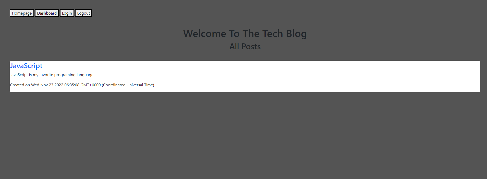
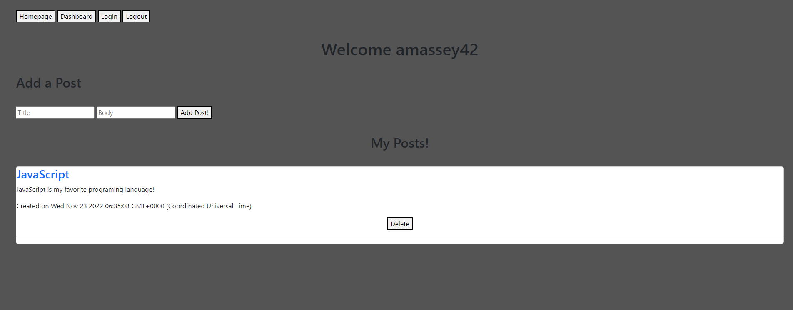

# tech-blog
## Description
This project was to create a Tech blog. In this program you can create an account and make posts about anything you like. You can view your profile and see all the posts you've made as well as click on a post from the main page and see who that post was created by. This project used Sequelize, express, mysql2, dotenv, bcrypt npm packages.

## Screenshots

## link to deployed app
[Tech Blog](https://andrewmasseytechblog.herokuapp.com/)